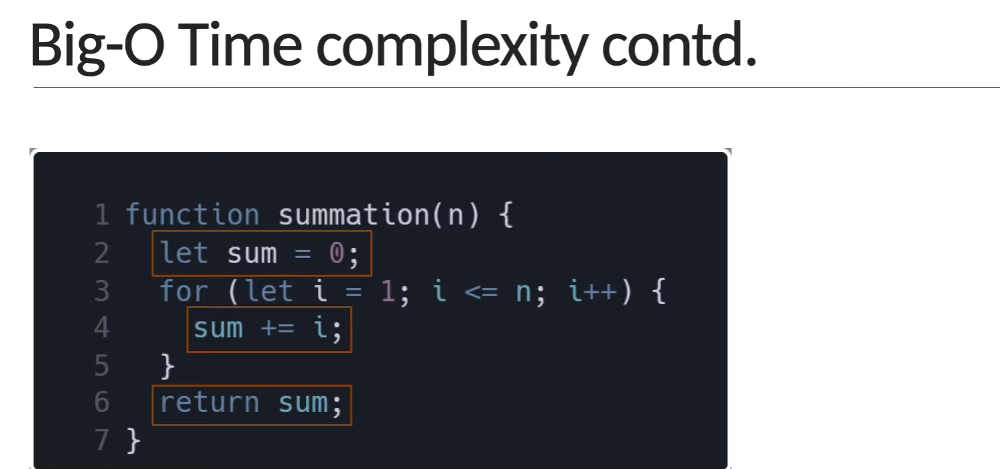
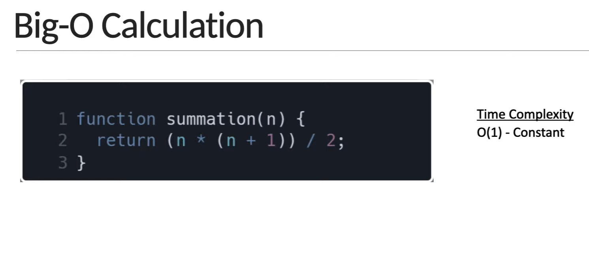

# ALGORITHMS & DATA STRUCTURES

Information Sources:
Bro Code - [ALGS & DS](https://youtu.be/CBYHwZcbD-s)

prerequesites
big O notation
NOTE:
learn log n and n log n
hashmaps/hashtables

big O notation is to describe which code is faster than the other, relying on none other than amount of operations
as it cant differ across machines compared to time, here are the following types of output

depending on what we coun't the number of operations can be as low as 2n or as high as 5n + 2
but regardless of the exact number, the number of operations grows roughly proportionally with n
if n duobles, the number of operations will also roughly double

it could go linear
f(n) could be linear (f(n) = n)
O(n) in notation aka time defined by n growing

or sharp ( quadratic )
f(n) could be quadratic (f(n) = n2)
O(n2) is when there is an O(n) operation within an O(n) operation for example a for loop that takes n

or stay in a same amount of time, relative to the growing n
f(n) could be constant (f(n) = 1)

or f(n) could be entirely different

simplify big o algs

O(2n) -> O(n)
O(500) -> O(1)
O(13n2) -> O(n2)
O(n + 10) -> O(n)
O(1000n + 50) -> O(n)
O(n2 + 5n + 8) -> O(n2)

what does better mean?
faster in time?
less memory intense?
more readable?

HOW TO FIND A time COMPLEXITY? BIG O SHORTHANDS
there are some rules they might not always work but can be a great starting point
1: arithmetics operations are constant.
2: variable assignment is constant
3: accessing elements in an array by index or object by key is constant
4: in a loop the complexity is the length of the loop times the complextiy of whatever happens within the loop

so if you know that something isn't N tied, then it is constant O(1), but if N influences the amount of time code has to iterate,
then it is O(n or n2)

Space complexity:
we can also use big o notation to analyze the space in hardware required for the code runtime

what about the input?
the more input grows the more space it might require ( wrote out of memory )
sometimes you will hear auxiliary space complexity, and that is when an alogirhm itself takes space
not including space taken by the input

space compelxity identifying rules:

- most primitives ( booleans , numbers, undefined, null ) are constant space
- strings are different, they require O(n) where n is string
- reference types are generally O(n) where n is the length (for arrays) or the number of keys (in object)
  example:
  
  its gonna be constant as we have only 2 variables that exists, and an array is not included why? because we are including only auxiliary and not input space
  and its always the same no matter the input (ABOUT THE CODE)
  another example:
  as the algorithms tightly dependant on the input its gonna be same
  

LOGARITHMS:
so what is logarithms?

exponent is the output of value / number ( in current case 2) until it isn't greater than 1
ex: log2 (8), 8/2 = 4/2 = 2/2 = 1

the shorthand for the log in big o notation is log that equals to log2

why care about logs in the first place?

RECAP:

OBJECTIVES:

INFO

BIG O of objects
unordered data

Arrays:

ordered data
index is a numeric value of an item
INFO

its methods

problem solving approach
problem solving patterns
recursion
searching algorithms
bubble sort
selection sort
insertion sort
merge sort
quick sort
radix sort

data structure

singly linkd lists
doubly linked lists
stacks & queues
binary search trees
tree traversal
binary heaps
hash tables
graphs
graph traversal
dijkstras algorithm

# TYPES OF REPRESENTAION OF COMPLEXITY

worst case complexity is represented using Big o notation
it describes the complexity of alg using algebraic terms
it has 2 characteristics,

- it is expressed in terms of the input
- it focuses on the bigger picture without gettingcaught up in the minute deatils, ( aka its own meausrement system )

it has 3 main statements to execute

here is the amount of times it executes based of an N

so it will be O(n+2)
we don't need as the bigger picture will be N the significant one
so it will be O(n) instead of full (n+2)

an example of a constant time complexity

it is cubic

the decrease of input by each iteration is logarithmic

GRAPH OF A COMPLEXTIY

RULE 1
there is no 1 working algorithms, there are always solutions for individual cases, so you choose what suits the best in your case

RULE 2
when writing programs, don't get lost at minor details, try to see as much bigger of a picture as you can, sometimes smarter code doesn't mean its better.

math algorithms
fibonacci sequence ( using recursion )
factorial of a number ( using recursion )
prime number
power of two
recursion

BIG O GUIDE

